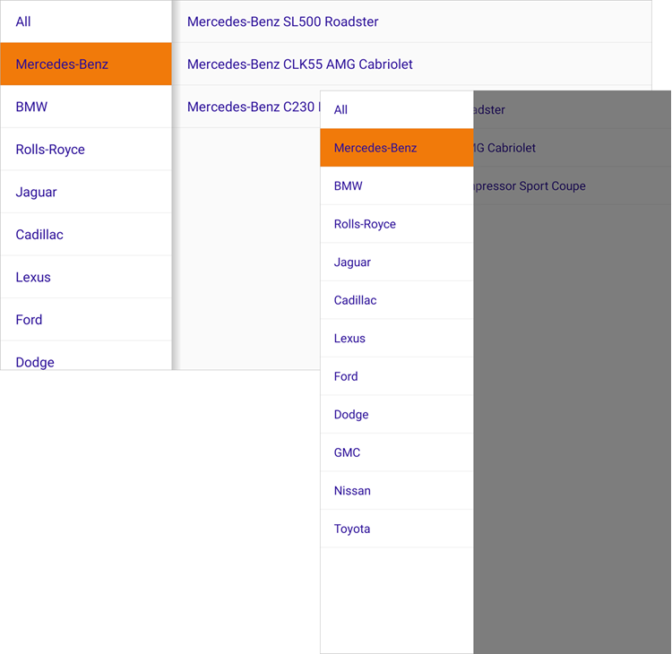

<!-- default badges list -->
[](https://supportcenter.devexpress.com/ticket/details/T1018580)
[](https://docs.devexpress.com/GeneralInformation/403183)
<!-- default badges end -->
# DevExpress Drawer View for .NET MAUI

[DevExpress Mobile UI](https://www.devexpress.com/maui/) allows you to use a .NET cross-platform UI toolkit and C# to build native apps for iOS and Android.


The **DevExpress Mobile UI for Xamarin.Forms and .NET MAUI** is free of charge. To learn more about our offer and to reserve your copy, visit [Free DevExpress Mobile UI for Xamarin.Forms and .NET MAUI](https://www.devexpress.com/xamarin-free).

## Requirements

Please register the DevExpress NuGet Gallery in Visual Studio to restore the NuGet packages used in this solution. See the following topic for more information: [Get Started with DevExpress Mobile UI for .NET MAUI](https://docs.devexpress.com/MAUI/403249/get-started).

## Documentation

- [Data Grid](https://docs.devexpress.com/MAUI/403255/data-grid/data-grid)
- [Charts](https://docs.devexpress.com/MAUI/403300/charts/charts)
- [Data Form](https://docs.devexpress.com/MAUI/403640/data-form)
- [Navigation](https://docs.devexpress.com/MAUI/403297/navigation/index)
- [Data Editors](https://docs.devexpress.com/MAUI/403427/editors/index)
- [Collection View](https://docs.devexpress.com/MAUI/403324/collection-view/index)

## More Examples

* [Stocks App](https://github.com/DevExpress-Examples/maui-stocks-mini)
* [Data Grid](https://github.com/DevExpress-Examples/maui-data-grid-get-started)
* [Data Form](https://github.com/DevExpress-Examples/maui-data-form-get-started)
* [Data Editors](https://github.com/DevExpress-Examples/maui-editors-get-started)
* [Pie Chart](https://github.com/DevExpress-Examples/maui-pie-chart-get-started)
* [Scatter Chart](https://github.com/DevExpress-Examples/maui-scatter-chart-get-started)
* [Tab Page](https://github.com/DevExpress-Examples/maui-tab-page-get-started)
* [Tab View](https://github.com/DevExpress-Examples/maui-tab-view-get-started)
* [Drawer Page](https://github.com/DevExpress-Examples/maui-drawer-page-get-started)
* [Collection View](https://github.com/DevExpress-Examples/maui-collection-view-get-started)

## What's in This Repository

This example allows you to get started with the [DrawerView](http://docs.devexpress.com/MAUI/DevExpress.Maui.Navigation.DrawerView) component — use it to add a [navigation drawer](https://material.io/design/components/navigation-drawer.html) to your .NET MAUI application.



### Files to Look At

<!-- default file list -->
* [MauiProgram.cs](./CS/DrawerViewExample/MauiProgram.cs)
* [MainPage.xaml](./CS/DrawerViewExample/MainPage.xaml)
* [MainPage.xaml.cs](./CS/DrawerViewExample/MainPage.xaml.cs)
* [CarModel.cs](./CS/DrawerViewExample/CarModel.cs)
* [CarBrandViewModel.cs](./CS/DrawerViewExample/CarBrandViewModel.cs)
* [MainViewModel.cs](./CS/DrawerViewExample/MainViewModel.cs)
<!-- default file list end -->

## How to Run This Application

1. Install a [.NET MAUI development](https://docs.microsoft.com/en-gb/dotnet/maui/get-started/installation) environment and open the solution in Visual Studio 22 Preview.
2. Register the following NuGet feed in Visual Studio: `https://nuget.devexpress.com/free/api`.  
	If you are an active DevExpress [Universal](https://www.devexpress.com/subscriptions/universal.xml) customer or have registered our [free Xamarin UI controls](https://www.devexpress.com/xamarin/), this MAUI preview will be available in your personal NuGet feed automatically.
4. Restore NuGet packages.  
5. Run the application on an Android or iOS device or emulator.  

## How to Reproduce This Application

The following step-by-step tutorial details how to reproduce this application.

### Create a New MAUI Application and Add a Drawer View

Create a new .NET MAUI solution in Visual Studio 22 Preview. Refer to the following Microsoft documentation for more information on how to get started with .NET MAUI: [.NET Multi-platform App UI](https://docs.microsoft.com/en-gb/dotnet/maui/).

Register `https://nuget.devexpress.com/free/api` as a package source in Visual Studio, if you are not an active DevExpress [Universal](https://www.devexpress.com/subscriptions/universal.xml) customer or have not yet registered our [free Xamarin UI controls](https://www.devexpress.com/xamarin/).

Install the **DevExpress.Maui.Navigation** package from your NuGet feed.

In the *MauiProgram.cs* file, call the **UseDevExpress** method to register handlers for all DevExpress components:

```cs
using Microsoft.Maui;
using Microsoft.Maui.Hosting;
using Microsoft.Maui.Controls.Hosting;
using DevExpress.Maui;

namespace DrawerViewExample {
    public static class MauiProgram {
        public static MauiApp CreateMauiApp() {
            var builder = MauiApp.CreateBuilder();
            builder
                .UseMauiApp<App>()
                .UseDevExpress()
                .ConfigureFonts(fonts =>
                {
                    fonts.AddFont("OpenSans-Regular.ttf", "OpenSansRegular");
                });
            return builder.Build();
        }
    }
}
```

In the *MainPage.xaml* file, use the *dxn* prefix to declare the **DevExpress.Maui.Navigation** namespace and add a [DrawerView](http://docs.devexpress.com/MAUI/DevExpress.Maui.Navigation.DrawerView) object to the main page:

```xaml
<ContentPage xmlns="http://schemas.microsoft.com/dotnet/2021/maui"
             xmlns:x="http://schemas.microsoft.com/winfx/2009/xaml"
             xmlns:dxn="clr-namespace:DevExpress.Maui.Navigation;assembly=DevExpress.Maui.Navigation"
             x:Class="DrawerViewExample.MainPage">
     <dxn:DrawerView/>
</ContentPage>
```

### Create Models and View Models
Add a **CarModel** class that specifies a data object in the application:

```cs
namespace DrawerViewExample {
    public class CarModel {
        public string BrandName { get; }
        public string ModelName { get; }
        public string FullName => $"{BrandName} {ModelName}";

        public CarModel(string brand, string model) {
            this.BrandName = brand;
            this.ModelName = model;
        }
    }
}
```

Create a **CarBrandViewModel** class that defines content for the drawer view: car make and corresponding models. The application will display brands in the drawer and matching models in the main content area:

```cs
using System;
using System.Linq;
using System.ComponentModel;
using System.Collections.Generic;
using System.Runtime.CompilerServices;

namespace DrawerViewExample {
    public class CarBrandViewModel : INotifyPropertyChanged  {
        public string BrandName { get; }
        public IReadOnlyList<CarModel> CarModels { get; }

        public event PropertyChangedEventHandler PropertyChanged;

        public CarBrandViewModel(string brandName, IEnumerable<CarModel> carModels) {
            if (String.IsNullOrEmpty(brandName)) {
                this.BrandName = String.Empty;
            }
            else {
                this.BrandName = brandName;
            }
            if (carModels == null) {
                this.CarModels = new List<CarModel>();
            }
            else {
                this.CarModels = carModels.ToList();
            }
        }
        private void RaisePropertyChanged([CallerMemberName] string caller = "") {
            PropertyChangedEventHandler handler = PropertyChanged;
            if (handler != null) {
                handler.Invoke(this, new PropertyChangedEventArgs(caller));
            }
        }
    }
}
```

Create a **MainViewModel** class that defines content for the MainPage (models grouped by make/brand):

```cs
using System.Linq;
using System.ComponentModel;
using System.Collections.Generic;
using System.Runtime.CompilerServices;

namespace DrawerViewExample {
    public class MainViewModel : INotifyPropertyChanged {
        private static readonly IReadOnlyList<CarModel> allCarModels = new List<CarModel> {
            new CarModel("Mercedes-Benz", "SL500 Roadster"),
            new CarModel("Mercedes-Benz", "CLK55 AMG Cabriolet"),
            new CarModel("Mercedes-Benz", "C230 Kompressor Sport Coupe"),
            new CarModel("BMW", "530i"),
            new CarModel("Rolls-Royce", "Corniche"),
            new CarModel("Jaguar", "S-Type 3.0"),
            new CarModel("Cadillac", "Seville"),
            new CarModel("Cadillac", "DeVille"),
            new CarModel("Lexus", "LS430"),
            new CarModel("Lexus", "GS430"),
            new CarModel("Ford", "Ranger FX-4"),
            new CarModel("Dodge", "RAM 1500"),
            new CarModel("GMC", "Siera Quadrasteer"),
            new CarModel("Nissan", "Crew Cab SE"),
            new CarModel("Toyota", "Tacoma S-Runner"),
        };

        public IReadOnlyList<CarBrandViewModel> CarModelsByBrand { get; }

        public event PropertyChangedEventHandler PropertyChanged;

        public MainViewModel() {
            List<CarBrandViewModel> carBrandViewModels = new List<CarBrandViewModel>();
            carBrandViewModels.Add(new CarBrandViewModel("All", allCarModels));

            IEnumerable<IGrouping<string, CarModel>> groupedCarModels = 
                                                        allCarModels.GroupBy(v => v.BrandName);
            foreach (IGrouping<string, CarModel> carModelGroup in groupedCarModels) {
                carBrandViewModels.Add(new CarBrandViewModel(carModelGroup.Key, carModelGroup));
            }
            CarModelsByBrand = carBrandViewModels;
        }

        private void RaisePropertyChanged([CallerMemberName] string caller = "") {
            PropertyChangedEventHandler handler = PropertyChanged;
            if (handler != null) {
                handler.Invoke(this, new PropertyChangedEventArgs(caller));
            }
        }
    }
}
```

### Specify the Drawer View Content
In the *MainPage.xaml* file:
1. Set the **ContentPage.BindingContext** property to a **MainViewModel** object.
2. Set the [DrawerView.DrawerContent](http://docs.devexpress.com/MAUI/DevExpress.Maui.Navigation.DrawerView.DrawerContent) property to a grid with a **ListView** object. Bind the list’s **ItemsSource** property to the **CarModelsByBrand** property of the view model, and set up list items to display brand names.
3. Set the [DrawerView.MainContent](http://docs.devexpress.com/MAUI/DevExpress.Maui.Navigation.DrawerView.MainContent) property to a grid with a **ListView** object. Specify the list’s **ItemsSource** binding. The bound list should contain car models corresponding to the selected brand.

```xaml
<ContentPage xmlns="http://schemas.microsoft.com/dotnet/2021/maui"
             xmlns:x="http://schemas.microsoft.com/winfx/2009/xaml"
             x:Class="DrawerViewExample.MainPage"
             xmlns:local="clr-namespace:DrawerViewExample"
             xmlns:dxn="clr-namespace:DevExpress.Maui.Navigation;assembly=DevExpress.Maui.Navigation">
    <ContentPage.BindingContext>
        <local:MainViewModel/>
    </ContentPage.BindingContext>
    <dxn:DrawerView>
        <dxn:DrawerView.DrawerContent>
            <Grid HeightRequest="800">
                <ListView x:Name="carBrandList" 
                          ItemsSource="{Binding CarModelsByBrand}">
                    <ListView.ItemTemplate>
                        <DataTemplate>
                            <ViewCell>
                                <Label Padding="5" Text="{Binding BrandName}" />
                            </ViewCell>
                        </DataTemplate>
                    </ListView.ItemTemplate>
                </ListView>
            </Grid>
        </dxn:DrawerView.DrawerContent>
        <dxn:DrawerView.MainContent>
            <Grid HeightRequest="800">
                <ListView BindingContext="{x:Reference carBrandList}"
                    ItemsSource="{Binding SelectedItem.CarModels}">
                    <ListView.ItemTemplate>
                        <DataTemplate>
                            <ViewCell>
                                <Label Padding="5" Text="{Binding FullName}" />
                            </ViewCell>
                        </DataTemplate>
                    </ListView.ItemTemplate>
                </ListView>
            </Grid>
        </dxn:DrawerView.MainContent>
    </dxn:DrawerView>
</ContentPage>
```

### Define the Drawer Behavior

Define drawer behavior depending on device or emulator orientation:  
- Landscape orientation – the drawer is always visible.
- Portrait orientation – the drawer moves out over the main content area when a user swipes a screen from the left edge.

Add the **IsLandscapeOriented** dependency property to the **MainPage** class:

```cs
using System;
using Microsoft.Maui.Controls;
using DevExpress.Maui.Navigation;

namespace DrawerViewExample {
    public partial class MainPage : ContentPage {
        const string IsLandscapeOrientedPropertyName = "IsLandscapeOriented";

        public static readonly BindableProperty IsLandscapeOrientedProperty = BindableProperty.Create(
            IsLandscapeOrientedPropertyName,
            typeof(bool),
            typeof(MainPage),
            defaultValue: false);

        public bool IsLandscapeOriented {
            get => (bool)GetValue(IsLandscapeOrientedProperty);
            set => SetValue(IsLandscapeOrientedProperty, value);
        }
        public MainPage() {
            InitializeComponent();
            SizeChanged += OnSizeChanged;
        }
        protected void OnSizeChanged(object sender, EventArgs args) {
            IsLandscapeOriented = this.Width > this.Height;
        }
    }
}
```

Implement a value converter that converts a Boolean value to a value of the **DrawerBehavior** enumeration:

```cs
using System.Globalization;
// ...

class BoolToDrawerBehaviorConverter : IValueConverter {
    public object Convert(object value, Type targetType, object parameter, CultureInfo culture) {
        if (targetType != typeof(DrawerBehavior)) return null;
        bool boolValue = (bool)value;
        return boolValue ? DrawerBehavior.Split : DrawerBehavior.SlideOnTop;
    }

    public object ConvertBack(object value, Type targetType, object parameter, CultureInfo culture) {
        throw new NotImplementedException();
    }
}
```

Bind the [DrawerView.DrawerBehavior](http://docs.devexpress.com/MAUI/DevExpress.Maui.Navigation.DrawerView.DrawerBehavior) property to **IsLandscapeOriented**:

```xaml
<ContentPage xmlns="http://schemas.microsoft.com/dotnet/2021/maui"
            xmlns:x="http://schemas.microsoft.com/winfx/2009/xaml"
            x:Class="DrawerViewExample.MainPage"
            xmlns:local="clr-namespace:DrawerViewExample"
            xmlns:dxn="clr-namespace:DevExpress.Maui.Navigation;assembly=DevExpress.Maui.Navigation"
            x:Name="page">
    <!-- ... -->
    <ContentPage.Resources>
        <local:BoolToDrawerBehaviorConverter x:Key="boolToDrawerBehaviorConverter"/>
    </ContentPage.Resources>
    <dxn:DrawerView DrawerBehavior="{Binding IsLandscapeOriented, Source={x:Reference page}, 
                                    Converter={StaticResource boolToDrawerBehaviorConverter}}">
        <!-- Other properteis of the drawer view are here. -->
    </dxn:DrawerView>
</ContentPage>
```

### Customize the Drawer Appearance
Use the following properties to customize the drawer size, shadow, and scrim:

```xaml
<dxn:DrawerView DrawerBehavior="{Binding IsLandscapeOriented, Source={x:Reference page}, 
                                Converter={StaticResource boolToDrawerBehaviorConverter}}"
                DrawerWidth="180"
                DrawerShadowHeight="10"
                DrawerShadowRadius="40"
                DrawerShadowColor="#808080"
                ScrimColor="#80000000">
    <!-- Other properties of the drawer view are here. -->
</dxn:DrawerView>
```

The scrim does not affect a drawer view when drawer behavior is set to **Split**.
